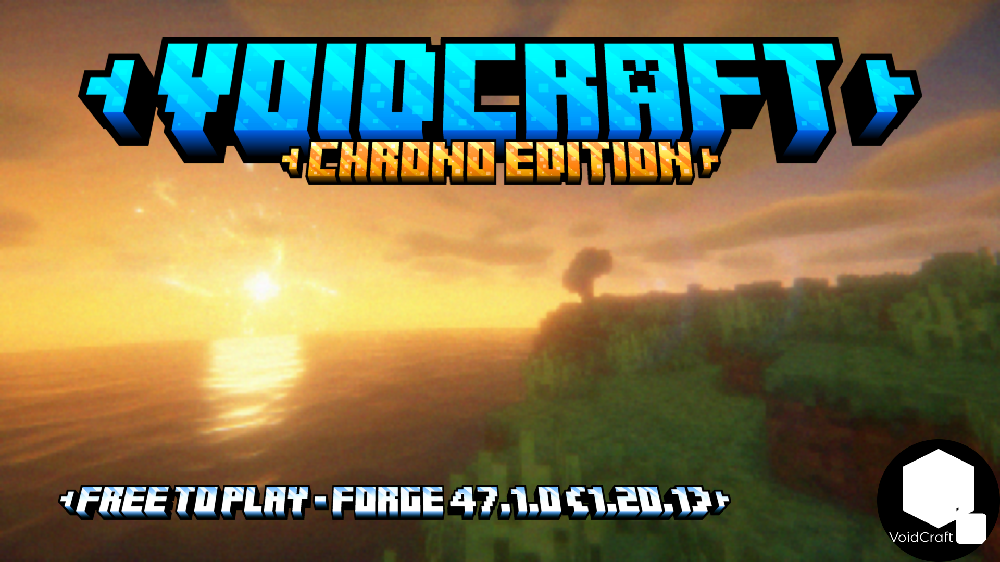

# VoidCraft
VoidCraft is a branch of Minecraft 1.20.1 where alot of new blocks are added!
## How to install
1. You need to have MultiMC and Forge 47.1.0.
2. At MultiMC create a new instance. Set the version to 1.20.1.
3. Click view mods, and click version. Click install Forge, set the version 47.1.0.
4. Go back to loader mods, and add the mod.
5. I *RECOMMEND* downloading the resource packs. These respacks are used for the ARG.
6. Click launch.
7. Enjoy the game!
## Downloads Page
https://voidcraftvoid.github.io/downloads/
